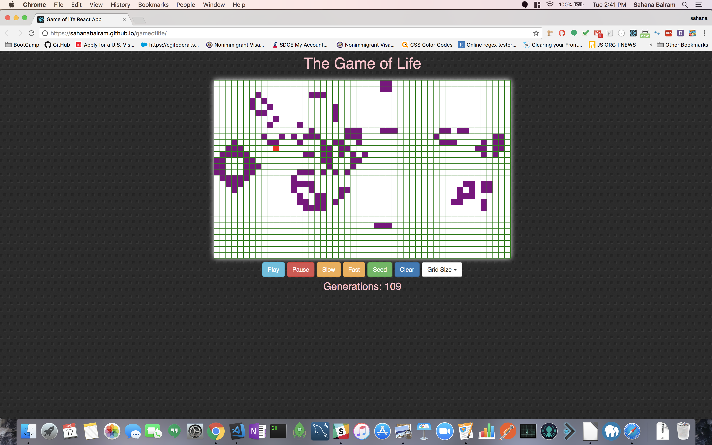

# Game Of Life

## Walkthrough
Rules of the Game:
1. Any live cell with fewer than two live neighbors dies, as if caused by under-population.
2. Any live cell with two or three live neighbors lives on to the next generation.
3. Any live cell with more than three live neighbors dies, as if by overcrowding.
4. Any dead cell with exactly three live neighbors becomes a live cell, as if by reproduction.

## Deployed Link
https://sahanabalram.github.io/gameoflife

## Author
Sahana Balram